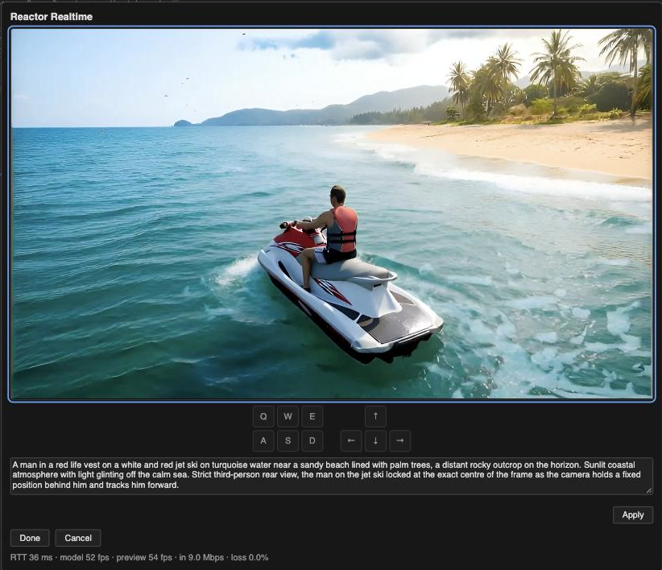
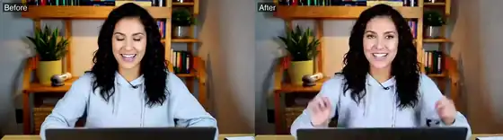
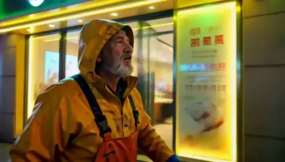

<div align="center">


**Real-time video models in ComfyUI. Steer them live, or script every shot.**

[🌐 Reactor](https://reactor.inc) · [📚 Docs](https://docs.reactor.inc) · [🛠️ Client SDKs](https://github.com/reactor-team/reactor-client-sdks) · [📖 Cookbook](https://github.com/reactor-team/reactor-cookbook)

</div>

---

A [ComfyUI](https://www.comfy.org) custom node pack for [Reactor](https://reactor.inc)'s real-time
video models. Play a model live in a window you steer as it generates, or script a sequence of
segments and render it to a video, all from a normal ComfyUI workflow.

<p align="center">
<br>
<sub>LingBot World 2 playing in the Reactor Realtime window, steered with W/A/S/D and the arrow keys.</sub>
</p>

## Getting started

**1. Install.** Clone this repo into `ComfyUI/custom_nodes/` and install its requirements into
ComfyUI's Python:

```bash
cd ComfyUI/custom_nodes
git clone https://github.com/reactor-team/comfyui-reactor-api
pip install -r comfyui-reactor-api/requirements.txt
```

**2. Add your API key.** Copy `config.ini.example` to `config.ini` and set your Reactor API key, or
set `REACTOR_API_KEY` in ComfyUI's environment (it takes priority).

**3. Copy the example inputs.** Copy `example_inputs/` into ComfyUI's `input` folder so the examples
find their images.

## Examples

Every example is in ComfyUI's template browser under **comfyui-reactor-api**, or drag a preview onto the canvas to load its workflow. Edit previews show the source on the left and the edit on the right.

Each example runs in one of two ways:

- **⚡ Real time** — the Reactor Realtime node opens a window where the model plays as it generates.
  Edit the prompt, drive the camera with the keyboard, feed it your webcam, or talk to an avatar.
- **🎬 Render** — chain segment nodes into a sequence and Reactor Render turns it into a video. Other
  nodes can write the prompts, make the images, or branch the story.

### Explore worlds

Walk through a world made from a single image, steering the camera live with the keyboard or
scripting every move ahead of time.

<table>
<tr>
<td width="50%" valign="top" align="center"><a href="example_workflows/Explore%20worlds%20-%20Real-time%20world%20driven%20with%20the%20keyboard%20%28LingBot%20World%202%29.json"></a><br><sub><b>Real-time world driven with the keyboard</b><br>LingBot World 2 · ⚡ Real time</sub></td>
<td width="50%" valign="top" align="center"><a href="example_workflows/Explore%20worlds%20-%20Scripted%20camera%20moves%20%28LingBot%20World%202%29.json"></a><br><sub><b>Scripted camera moves</b><br>LingBot World 2 · 🎬 Render</sub></td>
</tr>
</table>

### Edit video

Restyle, re-dress or recast your camera or a video file from a single image, or edit it with a
prompt. Source on the left, result on the right.

<table>
<tr>
<td width="50%" valign="top" align="center"><a href="example_workflows/Edit%20video%20-%20Real-time%20camera%20restyled%20from%20an%20image%20%28Vidu%20S2-Editing%29.json"></a><br><sub><b>Real-time camera restyled from an image</b><br>Vidu S2-Editing · ⚡ Real time</sub></td>
<td width="50%" valign="top" align="center"><a href="example_workflows/Edit%20video%20-%20Real-time%20camera%20dressed%20in%20an%20outfit%20from%20an%20image%20%28Vidu%20S2-Editing%29.json"></a><br><sub><b>Real-time camera dressed in an outfit from an image</b><br>Vidu S2-Editing · ⚡ Real time</sub></td>
</tr>
<tr>
<td width="50%" valign="top" align="center"><a href="example_workflows/Edit%20video%20-%20Real-time%20camera%20recast%20as%20a%20character%20from%20an%20image%20%28Vidu%20S2-Editing%29.json"></a><br><sub><b>Real-time camera recast as a character from an image</b><br>Vidu S2-Editing · ⚡ Real time</sub></td>
<td width="50%" valign="top" align="center"><a href="example_workflows/Edit%20video%20-%20Real-time%20camera%20edited%20by%20a%20prompt%20%28X2%29.json"></a><br><sub><b>Real-time camera edited by a prompt</b><br>X2 · ⚡ Real time</sub></td>
</tr>
<tr>
<td width="50%" valign="top" align="center"><a href="example_workflows/Edit%20video%20-%20Real-time%20video%20file%20edited%20by%20a%20prompt%20%28X2%29.json"></a><br><sub><b>Real-time video file edited by a prompt</b><br>X2 · ⚡ Real time</sub></td>
<td width="50%" valign="top" align="center"><a href="example_workflows/Edit%20video%20-%20Restyle%2C%20re-dress%20and%20recast%20a%20video%20%28Vidu%20S2-Editing%29.json"></a><br><sub><b>Restyle, re-dress and recast a video</b><br>Vidu S2-Editing · 🎬 Render</sub></td>
</tr>
</table>

### Generate video

Short clips with sound from a prompt with FastH3, or from pictures of a person and a place with
H3 Reference Turbo Realtime. Stories across shots and cuts, one continuous scene steered by prompts,
or a single shot that morphs, all from text.

<table>
<tr>
<td width="50%" valign="top" align="center"><a href="example_workflows/Generate%20video%20-%20Real-time%20clips%20with%20sound%20from%20a%20prompt%20%28FastH3%29.json"></a><br><sub><b>Real-time clips with sound from a prompt</b><br>FastH3 · ⚡ Real time</sub></td>
<td width="50%" valign="top" align="center"><a href="example_workflows/Generate%20video%20-%20Clips%20with%20sound%2C%20a%20shot%20then%20a%20cut%20%28FastH3%29.json"></a><br><sub><b>Clips with sound, a shot then a cut</b><br>FastH3 · 🎬 Render</sub></td>
</tr>
<tr>
<td width="50%" valign="top" align="center"><a href="example_workflows/Generate%20video%20-%20Real-time%20clips%20of%20a%20person%20and%20a%20place%20from%20two%20pictures%20%28H3%20Reference%20Turbo%20Realtime%29.json"></a><br><sub><b>Real-time clips of a person and a place from two pictures</b><br>H3 Reference Turbo Realtime · ⚡ Real time</sub></td>
<td width="50%" valign="top" align="center"><a href="example_workflows/Generate%20video%20-%20A%20person%20and%20a%20place%20from%20two%20pictures%20%28H3%20Reference%20Turbo%20Realtime%29.json"></a><br><sub><b>A person and a place from two pictures</b><br>H3 Reference Turbo Realtime · 🎬 Render</sub></td>
</tr>
</table>

<table>
<tr>
<td width="50%" valign="top" align="center"><a href="example_workflows/Generate%20video%20-%20Real-time%20video%20from%20a%20prompt%20%28LongLive-2.0%29.json"></a><br><sub><b>Real-time video from a prompt</b><br>LongLive-2.0 · ⚡ Real time</sub></td>
<td width="50%" valign="top" align="center"><a href="example_workflows/Generate%20video%20-%20Nine%20segments%20of%20shots%20and%20cuts%20%28LongLive-2.0%29.json"></a><br><sub><b>Nine segments of shots and cuts</b><br>LongLive-2.0 · 🎬 Render</sub></td>
</tr>
<tr>
<td width="50%" valign="top" align="center"><a href="example_workflows/Generate%20video%20-%20One%20scene%20steered%20by%20prompts%20%28Helios%29.json"></a><br><sub><b>One scene steered by prompts</b><br>Helios · 🎬 Render</sub></td>
<td width="50%" valign="top" align="center"><a href="example_workflows/Generate%20video%20-%20A%20storm%20morphing%20around%20one%20shot%20%28Visko%20Orbis%20Stable%29.json"></a><br><sub><b>A storm morphing around one shot</b><br>Visko Orbis Stable · 🎬 Render</sub></td>
</tr>
</table>

### Avatars

Talk with a character made from a photo: your voice goes in, video comes out. Or have a photo
speak your script, one take at a time.

<div align="center">

<table>
<tr>
<td colspan="2" width="100%" valign="top" align="center"><a href="example_workflows/Avatars%20-%20Real-time%20conversation%2C%20your%20voice%20in%20and%20video%20out%20%28Vidu%20S2-Avatar%29.json"></a><br><sub><b>Real-time conversation, your voice in and video out</b><br>Vidu S2-Avatar · ⚡ Real time</sub></td>
</tr>
<tr>
<td width="50%" valign="top" align="center"><a href="example_workflows/Avatars%20-%20Real-time%20takes%20of%20a%20photo%20speaking%20your%20script%20%28LTX%29.json"></a><br><sub><b>Real-time takes of a photo speaking your script</b><br>LTX · ⚡ Real time</sub></td>
<td width="50%" valign="top" align="center"><a href="example_workflows/Avatars%20-%20A%20photo%20speaks%20a%20script%20in%20two%20takes%20%28LTX%29.json"></a><br><sub><b>A photo speaks a script in two takes</b><br>LTX · 🎬 Render</sub></td>
</tr>
</table>

</div>

## Models

Read the model's prompt guide before writing prompts: it applies to the prompts you write here,
and each example's note links it.

### Explore worlds

| Model | What it does | Takes | Prompt guide |
| --- | --- | --- | --- |
| [LingBot World 2](https://docs.reactor.inc/model-api-reference/lingbot-world-2/overview) | LingBot with more camera control | first image, camera moves | [Prompt guide](https://docs.reactor.inc/model-api-reference/lingbot-world-2/prompt-guide) |
| [LingBot](https://docs.reactor.inc/model-api-reference/lingbot/overview) | A world you walk through | first image, camera moves | [Prompt guide](https://docs.reactor.inc/model-api-reference/lingbot/prompt-guide) |

### Edit video

| Model | What it does | Takes | Prompt guide |
| --- | --- | --- | --- |
| [Vidu S2-Editing](https://docs.reactor.inc/model-api-reference/vidu-s2-editing/overview) | Restyle, re-dress or recast from an image | video, image | [Prompt guide](https://docs.reactor.inc/model-api-reference/vidu-s2-editing/prompt-guide) |
| [X2](https://docs.reactor.inc/model-api-reference/x2/overview) | Edit a video or camera from a prompt | video, optional image | [Prompt guide](https://docs.reactor.inc/model-api-reference/x2/prompt-guide) |
| [Sana Streaming](https://docs.reactor.inc/model-api-reference/sana-streaming/overview) | Edit a video file from a prompt | video (Render only) | [Prompt guide](https://docs.reactor.inc/model-api-reference/sana-streaming/prompt-guide) |

### Generate video

| Model | What it does | Takes | Prompt guide |
| --- | --- | --- | --- |
| [FastH3](https://docs.reactor.inc/model-api-reference/fast-h3/overview) | Short clips with sound, one per prompt | prompt, image on any segment | [Prompt guide](https://docs.reactor.inc/model-api-reference/fast-h3/prompt-guide) |
| [H3 Reference Turbo Realtime](https://docs.reactor.inc/model-api-reference/h3-reference-to-video-turbo-realtime/overview) | Clips with sound, guided by up to nine pictures, which prompts call Picture 1, Picture 2, … in socket order | prompt, pictures | [Prompt guide](https://docs.reactor.inc/model-api-reference/h3-reference-to-video-turbo-realtime/prompt-guide) |
| [Helios](https://docs.reactor.inc/model-api-reference/helios/overview) | One continuous scene steered by prompts | prompt, image on any segment | [Prompt guide](https://docs.reactor.inc/model-api-reference/helios/prompt-guide) |
| [Visko Orbis Stable / Dynamic](https://docs.reactor.inc/model-api-reference/visko-orbis-stable/overview) | One unbroken shot that morphs, with sound | prompt, optional first image | [Stable](https://docs.reactor.inc/model-api-reference/visko-orbis-stable/prompt-guide), [Dynamic](https://docs.reactor.inc/model-api-reference/visko-orbis-dynamic/prompt-guide) |
| [LongLive-2.0](https://docs.reactor.inc/model-api-reference/longlive-v2/overview) | A story across shots and cuts, from text | prompt | [Prompt guide](https://docs.reactor.inc/model-api-reference/longlive-v2/prompt-guide) |

### Avatars

| Model | What it does | Takes | Prompt guide |
| --- | --- | --- | --- |
| [Vidu S2-Avatar](https://docs.reactor.inc/model-api-reference/vidu-s2-avatar/overview) | Talk with a character made from a photo | first image, persona | [Prompt guide](https://docs.reactor.inc/model-api-reference/vidu-s2-avatar/prompt-guide) |
| [LTX](https://docs.reactor.inc/model-api-reference/ltx/overview) | A person from a photo speaks your script | first image, script | [Prompt guide](https://docs.reactor.inc/model-api-reference/ltx/prompt-guide) |

**Not yet supported: HappyOyster.**

## Nodes

These are the nodes this plugin adds to ComfyUI, all under **Reactor** in the node menu.

| Node | What it does |
| --- | --- |
| **Reactor&nbsp;Realtime** | Runs a model in real time. Pick the model, queue it, and steer it in the window: edit the prompt and press Apply, drive the camera with W/A/S/D and the arrow keys, or talk to an avatar. Press Save to output the take as a video. |
| **Reactor&nbsp;&lt;model&gt;&nbsp;Segment** | One segment of a scripted sequence, with that model's inputs. Chain segments through `sequence`. The first segment holds the model's settings. Since every input is a normal ComfyUI input, other nodes can write the prompts, make the images, or branch the story. |
| **Reactor&nbsp;Render** | Renders a sequence and outputs a video. |
| **Reactor&nbsp;Sequence&nbsp;Join** | Plays sequences for the same model one after another. |
| **Reactor&nbsp;Sequence&nbsp;Visualizer** | Draws a sequence's segments and camera moves on a frame ruler. |
| **Reactor&nbsp;Vidu&nbsp;S2-Avatar&nbsp;Reference** | Tags an image as an object, outfit or background for an avatar segment. |
| **Reactor&nbsp;Camera&nbsp;Capture&nbsp;/<br>Microphone&nbsp;Capture** | Pick this browser's camera or microphone for Reactor Realtime. |

## Tips

- **Getting the same take every time?** In Reactor Realtime, a fixed `seed` with unchanged inputs
  reuses the last take. Set it to randomize to record a new take each time.
- **Looking for a take?** Reactor Realtime saves them to `reactor/realtime` in ComfyUI's `output`
  folder. Change it with the node's `filename_prefix`.
- **Talking to an avatar?** Wear headphones, so the Vidu S2-Avatar character doesn't hear itself.
- **Want to run more than one workflow at once?** ComfyUI runs one Reactor session at a time. Set
  `MAX_CONCURRENT` under `[Sessions]` in `config.ini` and restart to run more.

## Contributing

Pull requests are welcome. Run the tests before opening one; they need no ComfyUI install and no
Reactor API key:

```bash
uv run pytest -q tests
```

Sign off every commit (`git commit -s`): pull requests are checked for a
[DCO](https://developercertificate.org/) sign-off.

## Licensing

This repository is **Apache-2.0** licensed - see [`LICENSE`](LICENSE).
