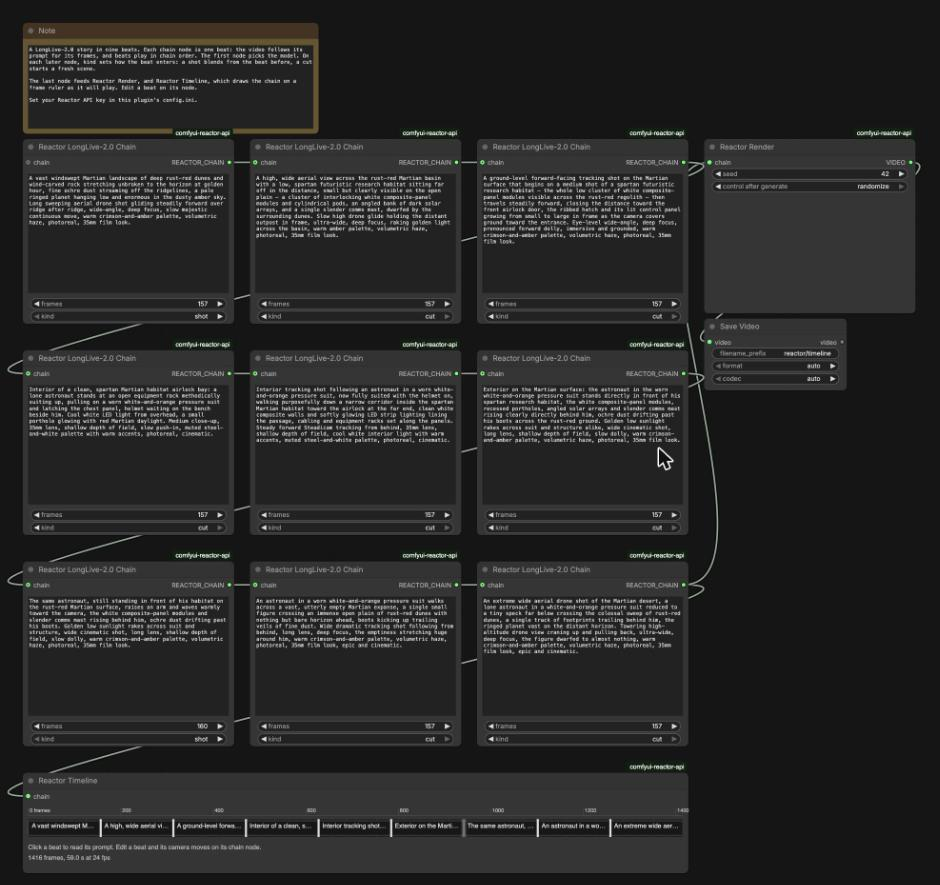
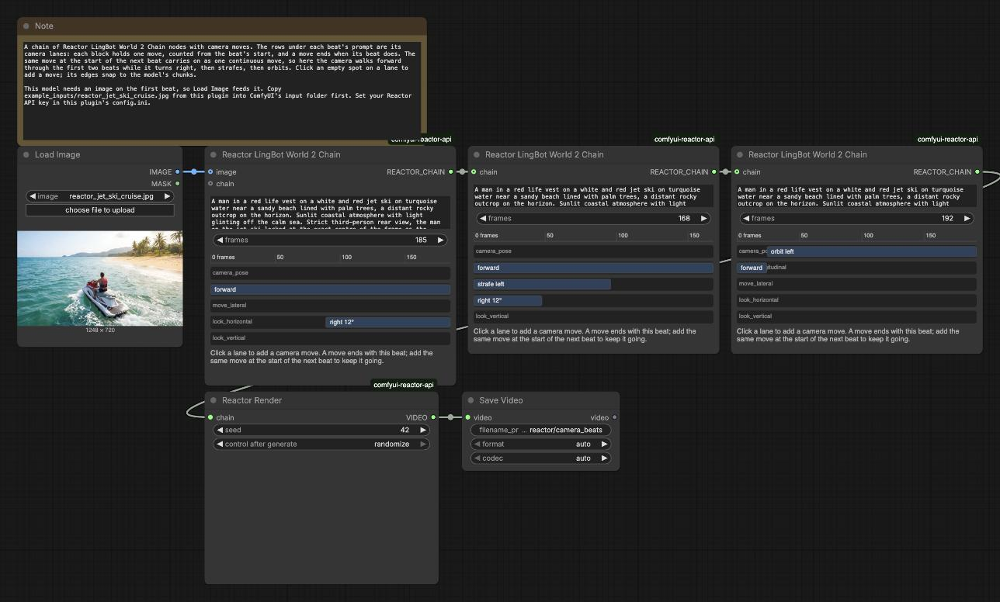

# comfyui-reactor-api

Render videos on [Reactor](https://docs.reactor.inc) real-time video models from ComfyUI. Lay out
prompt beats and camera moves as a chain of a model's nodes or on a timeline, and Reactor Render
returns the video.

<table>
  <tr>
    <td> LongLive-2.0: a nine-beat story with shots and cuts</td>
    <td> LingBot World 2: camera moves over a reference image</td>
  </tr>
  <tr>
    <td> Visko Orbis Stable: a storm morphing around one shot</td>
    <td> Helios: a scene steered by prompt changes, from text</td>
  </tr>
</table>

Click a preview for the video (480p). All four are example workflows from this repo, rendered at
seed 42.

## What you can do with each model

Each model has an overview page on docs.reactor.inc and a prompt guide. The prompt guides apply to
the beats you write here.

### LongLive-2.0

Tell a story across many scenes from text alone. Each beat is a shot. Mark a beat as a cut to start
fresh, or leave it as a shot to keep the same world and move the story on.
[Overview](https://docs.reactor.inc/model-api-reference/longlive-v2/overview) ·
[Prompt guide](https://docs.reactor.inc/model-api-reference/longlive-v2/prompt-guide)

### Helios

Generate one continuous scene and steer it with a new prompt on each beat. Any beat can take a
reference image to guide it. On Reactor Helios Chain, each beat's `image_strength` sets how closely
the scene holds to the image.
[Overview](https://docs.reactor.inc/model-api-reference/helios/overview) ·
[Prompt guide](https://docs.reactor.inc/model-api-reference/helios/prompt-guide)

### LingBot

Walk through a world grown from a seed image. The first beat's image sets how the world looks, the
prompt steers the rest, and the movement and look lanes drive the camera.
[Overview](https://docs.reactor.inc/model-api-reference/lingbot/overview) ·
[Prompt guide](https://docs.reactor.inc/model-api-reference/lingbot/prompt-guide)

### LingBot World 2

The next generation of LingBot. Forward and sideways movement have their own lanes, you can look
horizontally and vertically, and the camera pose lane adds directed camera moves. Change the prompt
between beats to restyle the weather, lighting, or events while the reference image stays.
[Overview](https://docs.reactor.inc/model-api-reference/lingbot-world-2/overview) ·
[Prompt guide](https://docs.reactor.inc/model-api-reference/lingbot-world-2/prompt-guide)

### Visko Orbis Stable and Visko Orbis Dynamic

Film one uninterrupted shot that changes as it plays. Each new beat's prompt morphs the picture
instead of cutting. Start from text, or anchor the opening frame with an image on the first beat.
Dynamic renders at its native 832x480 and Stable at its smallest size, 1080p.
The video has sound, made from the picture or described by each beat's `audio_prompt` on Reactor
Visko Orbis Chain. Turn `audio` off on the first beat to leave it out, which makes each chunk
cheaper to generate.
[Stable overview](https://docs.reactor.inc/model-api-reference/visko-orbis-stable/overview) ·
[Stable prompt guide](https://docs.reactor.inc/model-api-reference/visko-orbis-stable/prompt-guide) ·
[Dynamic overview](https://docs.reactor.inc/model-api-reference/visko-orbis-dynamic/overview) ·
[Dynamic prompt guide](https://docs.reactor.inc/model-api-reference/visko-orbis-dynamic/prompt-guide)

### Vidu S2-Avatar

Hold a conversation with a character made from a photo. The first beat's image is the person, and
each beat's prompt is said to them in turn. The character answers aloud, and the next beat starts
once it goes quiet and the beat's frames have played, so a beat can run longer than drawn but never
shorter. Set `persona` on the first beat to describe who they are; `voice` and `greeting` are optional,
and `greeting` is an instruction such as "Say hello and wave." Only the first beat takes an image.
To give the character an object, outfit or background, connect a Reactor Vidu S2-Avatar Reference to each beat it
lasts for; it goes away at the first beat without it. A reference takes a while to show, so give the
beat that adds one a long hold.
[Overview](https://docs.reactor.inc/model-api-reference/vidu-s2-avatar/overview) ·
[Prompt guide](https://docs.reactor.inc/model-api-reference/vidu-s2-avatar/prompt-guide)

| Model | Image | Cuts | Camera moves |
| --- | --- | --- | --- |
| LongLive-2.0 | — | yes | — |
| Helios | any beat | — | — |
| LingBot | first beat, required | — | yes |
| LingBot World 2 | first beat, required | — | yes |
| Visko Orbis Dynamic | first beat | — | — |
| Visko Orbis Stable | first beat | — | — |
| Vidu S2-Avatar | first beat, required; its references on any beat | — | — |

## Install

Clone or symlink this folder into `ComfyUI/custom_nodes/`, then install `requirements.txt` into
ComfyUI's Python. Copy `config.ini.example` to `config.ini` in this folder and set your Reactor API
key in it. You can also set `REACTOR_API_KEY` in the environment ComfyUI starts from; it takes
priority over `config.ini`. The key is stored in plain text, and `config.ini` is gitignored.

## Nodes

- **Reactor Timeline** is a visual editor. It starts from a chain and shows its beats on a frame
  ruler, then the beats you draw after them, snapped to the model's chunks, with camera lanes
  underneath for models that have camera controls.
- **Reactor <model> Chain**, such as Reactor Helios Chain, is a single beat for that model, with
  only the inputs the model takes. Each model's chain node is in its own submenu under Reactor, and
  searching "reactor chain" lists them all. Chain beats together instead of drawing them. The first
  beat also sets the model's settings, such as `audio` or `persona`; later beats hide them and
  change only the settings a model takes mid-run, such as `image_strength`, which hold until
  changed. Reactor Visko Orbis Chain covers both Visko Orbis models and picks one on its first
  beat. On the
  LingBots, each beat has its own camera moves, and a move that continues onto the next beat plays
  as one move.
- **Reactor Chain Join** plays chains or timelines one after another, as one chain. They must be for
  the same model, and the first chain's settings are used.
- **Reactor Vidu S2-Avatar Reference** tags an image as an object, outfit (`garment`) or background, with an
  optional sentence saying what happens, such as "He holds up the crystal ball." A beat holds up to 3.
- **Reactor Render** renders a chain, from its last beat, a Reactor Chain Join or a Reactor
  Timeline, and outputs a video.
- **Reactor Realtime** opens a live session from one chain beat, which sets the model, settings,
  prompt and image or video. You steer it while it plays, and each take is saved as a video.
- **Reactor Camera Capture** picks a camera on this browser to stream into Reactor Realtime.

## Two ways to build a timeline

**Draw it on Reactor Timeline.** This is the simple way. Connect the model's chain node for the
first beat and its settings, then add beats on the ruler, type a prompt into each one, drag the
edges to set how long it plays, and draw camera moves in the lanes underneath. `reactor_timeline_editor` and `reactor_camera_moves` work this
way.

**Build it from a model's chain nodes.** Use this for more control. Each beat is its own node, so the rest of
the graph can feed it:

- **ComfyUI nodes build the beats.** A beat's prompt, length, and image are ordinary inputs. Fill
  them from any other node, such as text built from templates, a prompt from a language model node,
  or an image you generated or edited earlier in the graph. For example, write each prompt as a
  Format Text template and feed it a character from a Custom Combo. Picking another character then
  recasts every beat.
- **Narratives can fork.** A beat's output can feed more than one next beat. Branch a shared opening
  into different endings. Give each branch its own Reactor Render to get every ending, or
  pick one with ComfyUI's If/Else Switch (still experimental). Only the chosen ending runs.

The first beat sets the model and its settings; later beats take them from the chain. Then connect
the last beat, or the switch, to Reactor Render. `reactor_beat_chain`, `reactor_camera_beats`,
`reactor_camera_events` and `reactor_ad_variants` work this way.

## Realtime

Reactor Realtime opens a window in ComfyUI that plays the model's output live. Edit the prompt there
and press Apply to change it mid-take; press Done to save the take under `reactor/realtime`, or
Cancel to drop it. With more than one camera, the window can switch cameras mid-take.

- **Video-to-video** models edit a source you stream in. Connect a Reactor Camera Capture to stream
  a camera, or connect a video to the beat to stream a file, which loops until you press Done. X2 also takes a
  reference image. Sana Streaming isn't available in Realtime yet; render it with Reactor Render.
- **Generating** models start from a prompt, and from an image where the model takes one. For
  models with camera lanes, click the video and drive with the keys shown under it: W, A, S and D move, the arrow keys look,
  and Q and E orbit on LingBot World 2. Models without camera lanes are steered by prompt alone.
- **Vidu S2-Avatar** holds a conversation with you. Connect the person's image to the beat and set
  `persona` on it. Talk to the character out loud, or type a message and press Send; it answers either
  way. The window asks for microphone access. Wear headphones so the character doesn't hear itself.
  The take records the character only, not your voice.

Live prompts work best written to each model's prompt guide:
[X2](https://docs.reactor.inc/model-api-reference/x2/prompt-guide) ·
[LingBot World 2](https://docs.reactor.inc/model-api-reference/lingbot-world-2/prompt-guide).

The window joins the take's Reactor session from this browser over WebRTC, so the preview is the
model's own output at full size, and a camera streams straight from this browser to Reactor. ComfyUI
records the take from the same session.

## Examples

Each workflow in `example_workflows/` also appears in ComfyUI's template browser under
comfyui-reactor-api. The scenes come from the examples in
[reactor-team/js-sdk](https://github.com/reactor-team/js-sdk). Workflows that start from an image load
it from ComfyUI's `input` folder, so copy `example_inputs/` there first. `reactor_realtime_video`
loads `example_outputs/reactor_camera_beats.mp4` the same way.

| Workflow | Model | Scene |
| --- | --- | --- |
| `reactor_timeline_editor` | LongLive-2.0 | Martian outpost: nine beats drawn on the timeline, shots and cuts |
| `reactor_beat_chain` | LongLive-2.0 | Wildlife montage: a chain of three beats, joined by cuts |
| `reactor_camera_moves` | LingBot World 2 | Jet ski cruise: beats and camera moves drawn on the timeline |
| `reactor_camera_beats` | LingBot World 2 | The same jet ski cruise as a chain of beats, each with its own moves |
| `reactor_camera_events` | LingBot World 2 | The jet ski ride on one camera path, with an event you pick: meteors, dolphins, a whale or a seaplane |
| `reactor_ad_variants` | LongLive-2.0 | Park ad: one opening, three audience endings rendered in one run, and a season you pick |
| `reactor_visko_orbis_stable` | Visko Orbis Stable | Fisherman in a storm, from an image |
| `reactor_helios` | Helios | King of the Jungle, from text |
| `reactor_video_edit` | Sana Streaming | The jet ski render edited, with a prompt change partway through |
| `reactor_realtime_prompt` | LongLive-2.0 | A live video from a prompt you change while it plays |
| `reactor_realtime_camera` | X2 | Live effect on your camera |
| `reactor_realtime_video` | X2 | The jet ski render restyled live as a woodblock print |
| `reactor_realtime_control` | LingBot World 2 | Drive the jet ski world live with the keyboard |

Each graph screenshot below has its workflow embedded. Drag one onto the ComfyUI canvas to load it.

`reactor_timeline_editor`:

`reactor_camera_beats`:

## Tests

`uv run pytest -q tests`
