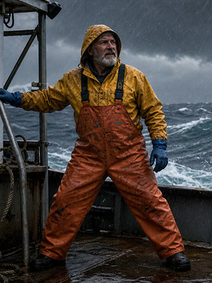

# comfyui-reactor-api

Run [Reactor](https://docs.reactor.inc) real-time video models in ComfyUI, either live in a window you
steer or as a scripted render.

Example 04 in ComfyUI: LingBot World 2 plays live in the Reactor Realtime window, and W/A/S/D and the
arrow keys move the camera through the world as it generates. Press Done and the take comes out of
the node as a video.

## Install

Clone or symlink this folder into `ComfyUI/custom_nodes/` and install `requirements.txt` into
ComfyUI's Python. Copy `config.ini.example` to `config.ini` and set your Reactor API key, or set
`REACTOR_API_KEY` in ComfyUI's environment (it takes priority).

Copy `example_inputs/` into ComfyUI's `input` folder so the examples find their images.

## Examples

All of these are in ComfyUI's template browser under comfyui-reactor-api. Click a preview for the
full render (15 shows its input image). You can also drop a preview on the canvas to load its workflow.

| Preview | Workflow | Model |
| --- | --- | --- |
|  | [06 Segments joined by cuts](<example_workflows/06 Generate video - Segments joined by cuts (LongLive-2.0).json>) | LongLive-2.0 |
|  | [07 Nine segments of shots and cuts](<example_workflows/07 Generate video - Nine segments of shots and cuts (LongLive-2.0).json>) | LongLive-2.0 |
|  | [08 One scene steered by prompts](<example_workflows/08 Generate video - One scene steered by prompts (Helios).json>) | Helios |
|  | [09 A storm morphing around one shot](<example_workflows/09 Generate video - A storm morphing around one shot (Visko Orbis Stable).json>) | Visko Orbis Stable |
|  | [10 Camera moves across a sequence](<example_workflows/10 Explore worlds - Camera moves across a sequence (LingBot World 2).json>) | LingBot World 2 |
|  | [14 Restyle, re-dress and recast a video](<example_workflows/14 Edit video - Restyle, re-dress and recast a video (Vidu S2-Editing).json>) | Vidu S2-Editing |
|  | [15 Two characters in conversation](<example_workflows/15 Avatars - Two characters in conversation (Vidu S2-Avatar).json>) | Vidu S2-Avatar |

## Nodes

- **Reactor Realtime**: runs a model live. Pick the model, queue it, and steer it in the window:
  edit the prompt and press Apply, drive the camera with W/A/S/D and the arrow keys, or talk to an
  avatar. Press Done to output the take as a video.
- **Reactor <model> Segment**: one segment of a scripted sequence, with that model's inputs. Chain
  segments through `sequence`. The first segment holds the model's settings. Since every input is a
  normal ComfyUI input, other nodes can write the prompts, make the images, or branch the story.
- **Reactor Render**: renders a sequence and outputs a video.
- **Reactor Sequence Join**: plays sequences for the same model one after another.
- **Reactor Sequence Visualizer**: draws a sequence's segments and camera moves on a frame ruler.
- **Reactor Vidu S2-Avatar Reference**: tags an image as an object, outfit or background for an
  avatar segment.
- **Reactor Camera Capture** / **Microphone Capture**: pick this browser's camera or microphone for
  Reactor Realtime.

## Models

| Model | What it does | Takes |
| --- | --- | --- |
| [LongLive-2.0](https://docs.reactor.inc/model-api-reference/longlive-v2/overview) | A story across shots and cuts, from text | prompt |
| [Helios](https://docs.reactor.inc/model-api-reference/helios/overview) | One continuous scene steered by prompts | prompt, image on any segment |
| [Visko Orbis Stable / Dynamic](https://docs.reactor.inc/model-api-reference/visko-orbis-stable/overview) | One unbroken shot that morphs, with sound | prompt, optional first image |
| [LingBot](https://docs.reactor.inc/model-api-reference/lingbot/overview) | A world you walk through | first image, camera moves |
| [LingBot World 2](https://docs.reactor.inc/model-api-reference/lingbot-world-2/overview) | LingBot with more camera control | first image, camera moves |
| [Sana Streaming](https://docs.reactor.inc/model-api-reference/sana-streaming/overview) | Edit a video file from a prompt | video (Render only) |
| [X2](https://docs.reactor.inc/model-api-reference/x2/overview) | Edit a video or camera from a prompt | video, optional image |
| [Vidu S2-Editing](https://docs.reactor.inc/model-api-reference/vidu-s2-editing/overview) | Restyle, re-dress or recast from an image | video, image |
| [Vidu S2-Avatar](https://docs.reactor.inc/model-api-reference/vidu-s2-avatar/overview) | Talk with a character made from a photo | first image, persona |

Each model's docs page has a prompt guide, and the guide applies to the prompts you write here.

## Notes

- ComfyUI runs one Reactor session at a time. Set `MAX_CONCURRENT` under `[Sessions]` in
  `config.ini` and restart to run more.
- In Realtime, a fixed `seed` with unchanged inputs reuses the last take. Set it to randomize to
  record a new take each time.
- For Vidu S2-Avatar, wear headphones so the character doesn't hear itself.
- Realtime takes are saved under `reactor/realtime`.

## Tests

`uv run pytest -q tests`
